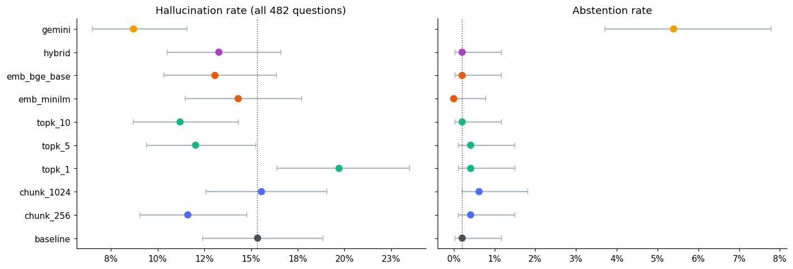
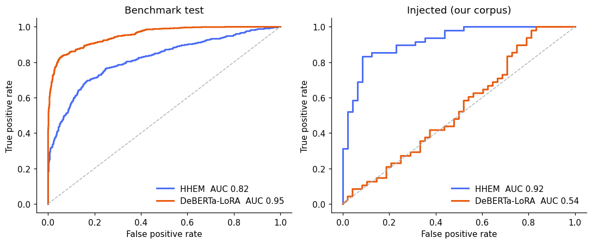
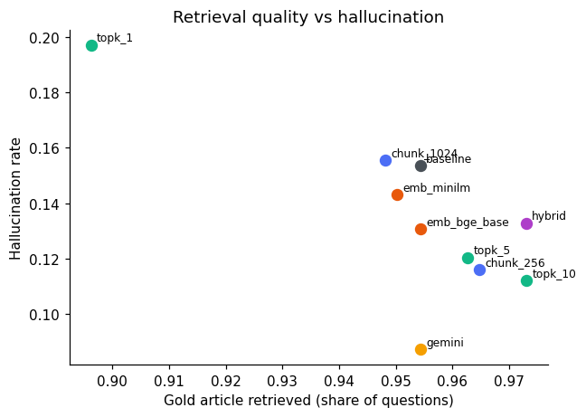

# RAG Hallucination Evaluation — Results Report

## Research question
How do RAG design choices (chunk size, top-k, embedding model, dense vs hybrid retrieval, generator) affect the
hallucination rate of a retrieval-augmented QA system, and which automatic detector is reliable enough to measure it?

## Setup
- Knowledge base: 300 English Wikipedia articles (2023-11-01 dump), SentenceSplitter chunks (overlap 50).
- Test set: 482 questions with gold answers generated from the corpus.
- Baseline retrieval (512-token chunks, bge-small, dense): Hit@1 0.896, Hit@3 0.954, MRR 0.926.
- Generators: Qwen2.5-1.5B-Instruct (local, greedy) for the grid; Gemini Flash-Lite for the original 482 answers.
- Outcome per answer: **abstained** (explicit refusal) or, if answered, **hallucinated** when the detector's signal
  ≥ 0.319 against every retrieved chunk (per-chunk max support).

## Part A — Choosing the detector
DeBERTa-v3-small + LoRA trained on 20,781 RAGTruth/HaluEval examples (best validation AUC
0.906; reload check max difference 0.0000).

| detector             | eval_set              |    n |   n_pos |   auc |   auc_lo |   auc_hi |   recall |   fpr |
|:---------------------|:----------------------|-----:|--------:|------:|---------:|---------:|---------:|------:|
| HHEM@0.5             | benchmark test        | 2000 |     834 | 0.82  |    0.801 |    0.839 |    0.639 | 0.13  |
| HHEM@0.5             | benchmark: RAGTruth   | 1000 |     345 | 0.837 |    0.812 |    0.861 |    0.559 | 0.119 |
| HHEM@0.5             | benchmark: HaluEval   | 1000 |     489 | 0.791 |    0.762 |    0.821 |    0.695 | 0.143 |
| HHEM@0.5             | injected (ours)       |   96 |      48 | 0.919 |    0.855 |    0.967 |    0.896 | 0.312 |
| HHEM@0.5             | human-labelled (ours) |   53 |       2 | 0.52  |    0.039 |    0.981 |    0.5   | 0.294 |
| HHEM (tuned)         | benchmark test        | 2000 |     834 | 0.82  |    0.801 |    0.839 |    0.765 | 0.249 |
| HHEM (tuned)         | benchmark: RAGTruth   | 1000 |     345 | 0.837 |    0.812 |    0.861 |    0.768 | 0.212 |
| HHEM (tuned)         | benchmark: HaluEval   | 1000 |     489 | 0.791 |    0.762 |    0.821 |    0.763 | 0.295 |
| HHEM (tuned)         | injected (ours)       |   96 |      48 | 0.919 |    0.855 |    0.967 |    0.979 | 0.438 |
| HHEM (tuned)         | human-labelled (ours) |   53 |       2 | 0.52  |    0.039 |    0.981 |    0.5   | 0.412 |
| DeBERTa-LoRA (tuned) | benchmark test        | 2000 |     834 | 0.952 |    0.943 |    0.96  |    0.831 | 0.059 |
| DeBERTa-LoRA (tuned) | benchmark: RAGTruth   | 1000 |     345 | 0.835 |    0.807 |    0.862 |    0.62  | 0.093 |
| DeBERTa-LoRA (tuned) | benchmark: HaluEval   | 1000 |     489 | 0.996 |    0.993 |    0.999 |    0.98  | 0.016 |
| DeBERTa-LoRA (tuned) | injected (ours)       |   96 |      48 | 0.537 |    0.425 |    0.652 |    0.833 | 0.729 |
| DeBERTa-LoRA (tuned) | human-labelled (ours) |   53 |       2 | 0.52  |    0.275 |    0.756 |    1     | 0.706 |

**Chosen detector: HHEM (tuned)** — highest mean AUC over benchmark-test and injected sets; threshold = Youden J on benchmark val.

## Part B — Experiment results (482 paired questions per configuration)
| config       |   halluc_rate |   halluc_lo |   halluc_hi |   abstain_rate |   gold_retrieved_rate |   answer_recall |
|:-------------|--------------:|------------:|------------:|---------------:|----------------------:|----------------:|
| baseline     |         0.154 |       0.124 |       0.188 |          0.002 |                 0.954 |           0.859 |
| chunk_256    |         0.116 |       0.091 |       0.148 |          0.004 |                 0.965 |           0.843 |
| chunk_1024   |         0.156 |       0.126 |       0.191 |          0.006 |                 0.948 |           0.863 |
| topk_1       |         0.197 |       0.164 |       0.235 |          0.004 |                 0.896 |           0.782 |
| topk_5       |         0.12  |       0.094 |       0.152 |          0.004 |                 0.963 |           0.856 |
| topk_10      |         0.112 |       0.087 |       0.143 |          0.002 |                 0.973 |           0.861 |
| emb_minilm   |         0.143 |       0.115 |       0.177 |          0     |                 0.95  |           0.842 |
| emb_bge_base |         0.131 |       0.104 |       0.164 |          0.002 |                 0.954 |           0.853 |
| hybrid       |         0.133 |       0.105 |       0.166 |          0.002 |                 0.973 |           0.872 |
| gemini       |         0.087 |       0.065 |       0.116 |          0.054 |                 0.954 |           0.897 |

### Pairwise vs baseline (McNemar exact, Holm-corrected)
| config       |    diff |   diff_lo |   diff_hi |   cohens_h |   p_mcnemar |   p_holm | significant   |
|:-------------|--------:|----------:|----------:|-----------:|------------:|---------:|:--------------|
| chunk_256    | -0.0373 |   -0.0705 |   -0.0041 |    -0.1096 |      0.0328 |   0.1638 | False         |
| chunk_1024   |  0.0021 |   -0.0332 |    0.0353 |     0.0057 |      1      |   1      | False         |
| topk_1       |  0.0436 |    0.0083 |    0.0788 |     0.1148 |      0.0186 |   0.1303 | False         |
| topk_5       | -0.0332 |   -0.0602 |   -0.0083 |    -0.0967 |      0.0195 |   0.1303 | False         |
| topk_10      | -0.0415 |   -0.0726 |   -0.0124 |    -0.1226 |      0.0078 |   0.0623 | False         |
| emb_minilm   | -0.0104 |   -0.0415 |    0.0187 |    -0.0292 |      0.5966 |   1      | False         |
| emb_bge_base | -0.0228 |   -0.0498 |    0.0021 |    -0.0654 |      0.1263 |   0.5052 | False         |
| hybrid       | -0.0207 |   -0.0477 |    0.0062 |    -0.0593 |      0.1934 |   0.5802 | False         |
| gemini       | -0.0664 |   -0.1017 |   -0.0311 |    -0.2059 |      0.0004 |   0.0034 | True          |

### Factor-level tests
| factor     |    chi2 |   p_chi2 |   cramers_v |   cochrans_q |   p_cochran |
|:-----------|--------:|---------:|------------:|-------------:|------------:|
| chunk_size |  3.8991 |   0.1423 |      0.0519 |       6.7921 |      0.0335 |
| top_k      | 17.3426 |   0.0006 |      0.0948 |      32.439  |      0      |
| embedding  |  1.0303 |   0.5974 |      0.0267 |       2.4267 |      0.2972 |
| retrieval  |  0.685  |   0.4079 |      0.0267 |       2.0833 |      0.1489 |
| generator  |  9.4177 |   0.0021 |      0.0988 |      13.1282 |      0.0003 |

### Retrieval failure and hallucination
Hallucination rate when the gold article was retrieved: 11.2%;
when it was missed: 74.1% (χ² p = 7.02e-135).

## Key findings
- Baseline (Qwen, 512/top-3/bge-small/dense) hallucination rate: 15.4% (95% CI 12.4%–18.8%); abstention 0.2%.
- Configurations significantly different from baseline after Holm correction: gemini.
- Lowest hallucination: gemini (8.7%); highest: topk_1 (19.7%).

## Methodological corrections made during the project
1. Human labelling round 1 truncated context to 1,500 characters → relabelled with full context.
2. Abstentions separated from hallucinations (3-class outcome).
3. HHEM scored per retrieved chunk instead of on a truncated concatenation.
4. Thresholds fixed on a benchmark validation split instead of being fitted to 3 positive labels.
5. DeBERTa-LoRA: randomly initialised pooler was not saved → added to `modules_to_save`; reload test added;
   pair encoding so the answer is never truncated; official RAGTruth split to avoid leakage.
6. Paired tests (McNemar, Cochran's Q) because all configurations answer the same questions.

## Limitations
- Automatic detection is imperfect (see detector table); rates are *detector-measured* rates.
- 75 human labels contain very few true hallucinations; the injected set is synthetic.
- One-factor-at-a-time design does not estimate interactions between factors.
- Gold Q&A pairs were LLM-generated from the same corpus and are answerable by construction.

